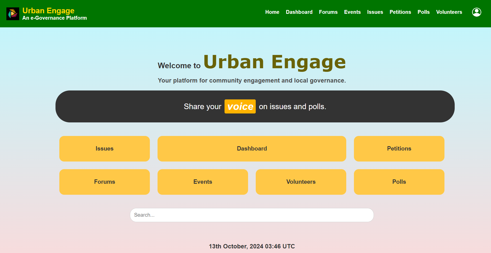
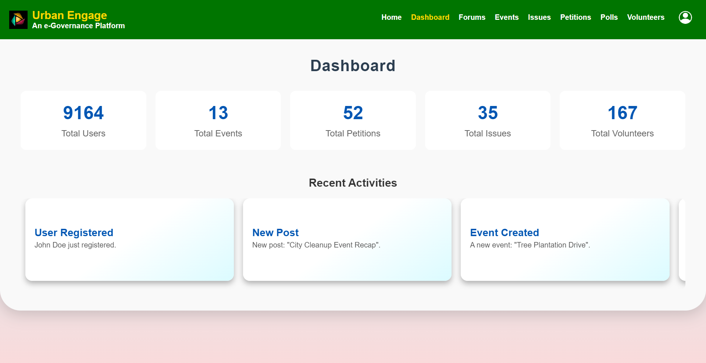
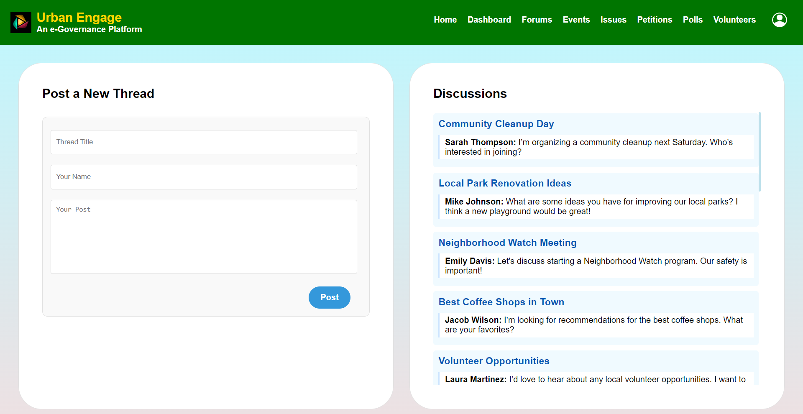
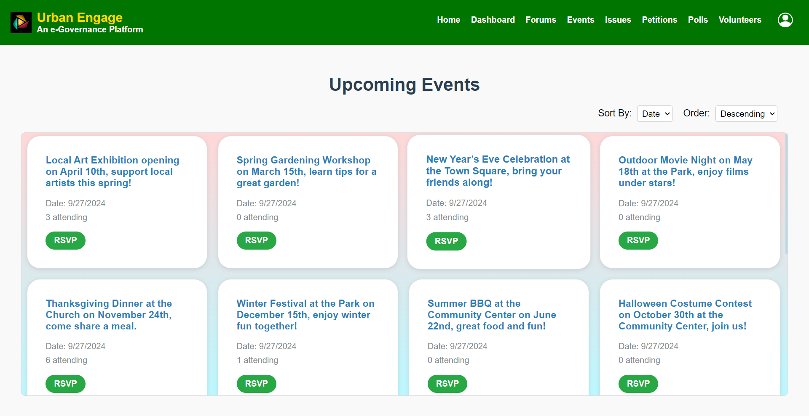
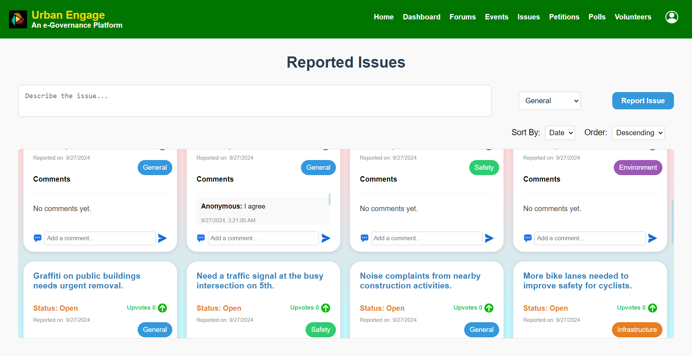
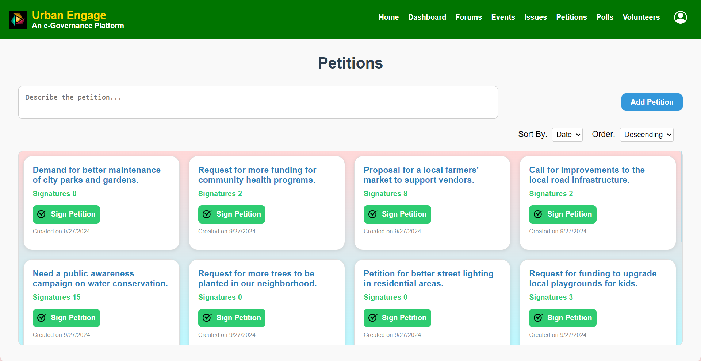
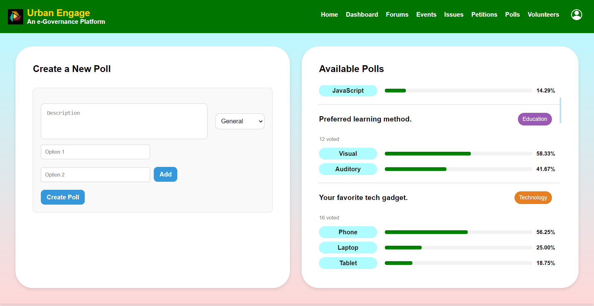
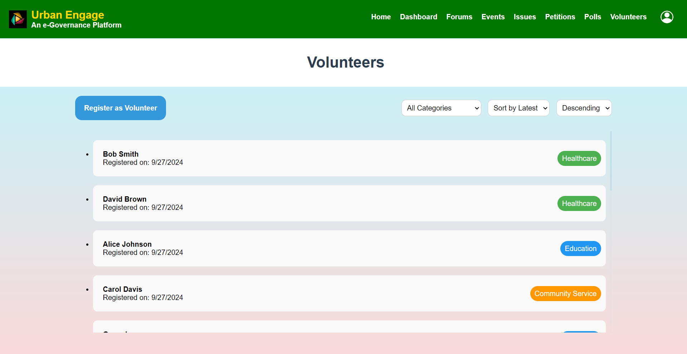
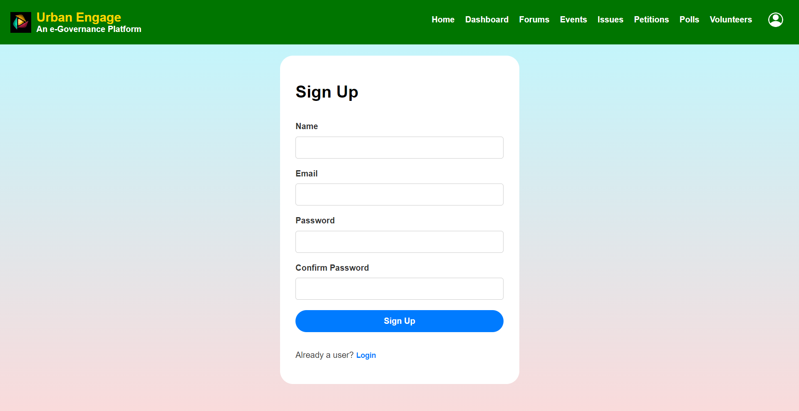

# Urban Engage

Urban Engage is an innovative e-governance platform designed to facilitate communication and interaction between citizens and local authorities. The platform offers various modules to improve civic engagement, issue reporting, and community building.

To visit the deployed application [Clicke Here](https://urbanengage.netlify.app/) &nbsp; (Desktop recommended).
<br><br>
## Table of Contents

- [Project Overview](#project-overview)
- [Technologies Used](#technologies-used)
- [Features](#features)
  - [Home](#home)
  - [Dashboard](#dashboard)
  - [Forums](#forums)
  - [Events](#events)
  - [Issues](#issues)
  - [Petitions](#petitions)
  - [Polls](#polls)
  - [Volunteers](#volunteers)
  - [Accounts](#accounts)
- [Installation and Setup](#installation-and-setup)
- [Contributing](#contributing)
- [License](#license)
<br><br>
## Project Overview

Urban Engage is a responsive and scalable web application built using the MERN stack (MongoDB, Express.js, React, and Node.js). The platform provides a comprehensive e-governance solution for citizens to report issues, participate in community discussions, create petitions, and engage with local events. Urban Engage simplifies community engagement by centralizing communication channels and offering tools for better collaboration.

The application achieves a high level of efficiency and performance through asynchronous communication between the client and server, optimized database queries, and responsive front-end design techniques. It is designed to handle large amounts of data and user interactions while ensuring a seamless user experience.
<br><br>
## Technologies Used

The following technologies were used in the development of this project:

- **Frontend**: React.js, JavaScript, HTML5, CSS3, Bootstrap
- **Backend**: Node.js, Express.js
- **Database**: MongoDB (NoSQL database)
- **Authentication**: JWT (JSON Web Tokens)
- **Deployment**: 
  - Frontend: [Netlify](https://www.netlify.com/)
  - Backend: [Render](https://render.com/)
- **Version Control**: Git, GitHub
<br><br>
## Features

### Home

- The home page provides a welcome message and a brief overview of the platform’s core features.
- Quick links are available for direct navigation to the Dashboard, Forums, Events, and more.
- Users can see the latest updates and news relevant to their community.
- A search bar is integrated to allow easy navigation across the platform.



### Dashboard

- The personalized user dashboard gives a summary of the user’s activity, upcoming events, and recent discussions.
- Quick stats on issues reported, petitions signed, and events RSVP’d are displayed.
- Users can also manage their profile settings directly from the dashboard.



### Forums

- The forum section supports categorized discussions on various topics relevant to the community.
- Users can engage in threaded conversations and reply to other posts.
- User profiles are visible along with reputation scores based on activity.
- Moderation tools allow for content reporting and administrative control.



### Events

- Upcoming community events are displayed in a calendar view.
- Event details include date, time, location, and description, with an option to RSVP.
- Users with the necessary permissions can create and manage events.



### Issues

- The issues module enables users to report local issues such as infrastructure problems or community concerns.
- Status tracking is available for each issue (pending, in progress, resolved).
- Users can comment, upvote, and track the resolution of reported issues.
- Analytics tools provide historical data on issue trends.



### Petitions

- Users can create, view, and sign petitions directly on the platform.
- Each petition includes details such as goals, description, and deadlines.
- Progress is tracked, and the number of signatures is displayed in real-time.



### Polls

- Polls allow users to participate in decision-making by voting on various topics.
- Real-time results are displayed after votes are cast.
- Users can also create polls on subjects of community interest.



### Volunteers

- A list of available volunteer opportunities is displayed.
- Users can sign up to volunteer for events or initiatives and track their activity.
- Volunteer coordination tools assist organizers in managing volunteer projects efficiently.



### Accounts

- User authentication is secured using JWT, allowing for a secure and efficient login and sign-up experience.
- Users can update their personal information, manage privacy settings, and view account history.
- Real-time authentication ensures data security and privacy.


<br><br>
## Installation and Setup

To get a local copy of this project up and running, follow these simple steps.

### Prerequisites

- Node.js (v14.x or higher)
- MongoDB (local or cloud instance)
- Git

### Installation

1. **Clone the repository:**

   ```bash
   git clone https://github.com/singhtanishq/UrbanEngage.git
   cd UrbanEngage
   ```

2. **Install dependencies for both client and server:**

   ```bash
   # For backend
   cd backend
   npm install

   # For frontend
   cd ../frontend
   npm install
   ```

3. **Create a `.env` file in the backend folder with the following variables:**

   ```bash
   MONGODB_URI=<your-mongodb-uri>
   JWT_SECRET=<your-jwt-secret>
   ```

4. **Run the development servers:**

   ```bash
   # Backend server
   cd backend
   npm start

   # Frontend server
   cd ../frontend
   npm start
   ```

   The application will run on `localhost:3000` for the frontend and `localhost:5000` for the backend.
<br><br>
## Contributing

Contributions are what make the open-source community such an amazing place to learn, inspire, and create. Any contributions you make are **greatly appreciated**.

To contribute:

1. Fork the Project
2. Create your Feature Branch (`git checkout -b feature/AmazingFeature`)
3. Commit your Changes (`git commit -m 'Add some AmazingFeature'`)
4. Push to the Branch (`git push origin feature/AmazingFeature`)
5. Open a Pull Request
<br><br>
## License

Distributed under the MIT License. See `LICENSE` for more information.
