<div align="center">

# 🏙 Urban Engage

### 🌐 An e-Governance Platform — Connecting Citizens, Communities & Local Authorities

Urban Engage is a modern e-governance platform designed to make civic participation more accessible, transparent, and interactive. It provides citizens with a single digital space to report civic issues, participate in discussions, discover community events, support petitions, vote in polls, and contribute to local initiatives.

[](https://urbanengage.netlify.app/)

[](https://react.dev/)
[](https://expressjs.com/)
[](https://www.mongodb.com/)
[](https://www.netlify.com/)

</div>

---

## 📑 Table of Contents

**Getting Started**

- [Overview](#-overview) · [Live Project](#-live-project) · [Platform Highlights](#-platform-highlights)

**Platform Modules**

- [Home](#-home) · [Dashboard](#-dashboard) · [Forums](#-forums) · [Events](#-events) · [Issues](#-issues) · [Petitions](#-petitions) · [Polls](#-polls) · [Volunteers](#-volunteers) · [Accounts & Authentication](#-accounts--authentication)

**Design & Engineering**

- [Design & User Experience](#-design--user-experience) · [Accessibility](#-accessibility) · [Technology Stack](#-technology-stack) · [Project Structure](#-project-structure) · [Application Architecture](#-application-architecture)

**Setup & Operations**

- [Installation & Setup](#-installation--setup) · [Environment Variables](#-environment-variables) · [API Reference](#-api-reference) · [Authentication](#-authentication) · [Deployment](#-deployment) · [Database](#-database) · [Security](#-security)

**Project Information**

- [Development Workflow](#-development-workflow) · [Documentation Screenshots](#-documentation-screenshots) · [Development Notes](#-development-notes) · [Contributing](#-contributing) · [Git & Repository Hygiene](#-git--repository-hygiene) · [Module Summary](#-module-summary) · [Future Expansion](#-future-expansion) · [Project Philosophy](#-project-philosophy) · [License](#-license) · [About This Project](#-about-this-project)

---

## 📖 Overview

Urban Engage is a modern e-governance platform focused on improving communication, participation, and interaction between citizens and local authorities.

The platform brings together several common civic and community workflows into one unified digital experience. Citizens can report civic issues, participate in public discussions, discover and RSVP to community events, create and support petitions, vote in polls, and register for volunteer opportunities.

This repository contains a fully revamped version of the platform with:

- A redesigned and animated professional React interface
- A responsive custom design system
- Modular frontend architecture
- A hardened Express/MongoDB REST API
- JWT-based authentication
- Secure password hashing
- Request validation and centralized error handling
- Security middleware and rate limiting
- Production-oriented deployment configuration
- Live platform statistics and activity data

Urban Engage is designed around a simple civic participation journey:

```text
Discover → Participate → Report → Discuss → Support → Contribute
```

The goal is to provide citizens with a single platform where they can discover what is happening in their community and actively participate in it.

---

## 🚀 Live Project

The platform is deployed and publicly accessible: **[Open Urban Engage →](https://urbanengage.netlify.app/)**

| Service     | URL                              |
| ----------- | -------------------------------- |
| Frontend    | https://urbanengage.netlify.app/ |
| Backend API | https://urbanengage.onrender.com |

Production hosting:

```text
Frontend  →  Netlify
Backend   →  Render
Database  →  MongoDB Atlas
```

---

## ✨ Platform Highlights

Urban Engage combines several civic and community-focused workflows into one application.

| Module            | Purpose                                                                |
| ----------------- | ---------------------------------------------------------------------- |
| 🏠 **Home**       | Discover the platform, its major capabilities, and civic workflows      |
| 📊 **Dashboard**  | View live statistics, recent activity, and quick actions                |
| 💬 **Forums**     | Start discussions, search threads, and participate in replies           |
| 📅 **Events**     | Discover community activities and RSVP to events                        |
| 🚨 **Issues**     | Report civic issues and track their resolution status                   |
| 📝 **Petitions**  | Create petitions and collect community signatures                       |
| 🗳 **Polls**      | Create polls and participate in community voting                        |
| 🤝 **Volunteers** | Register for community initiatives and volunteer opportunities          |
| 👤 **Accounts**   | Sign up, sign in, manage profiles, and maintain authenticated sessions  |

---

## 🏠 Home

The Home page is the primary entry point to Urban Engage. It introduces the platform, explains its purpose, highlights major capabilities, and provides quick paths into civic actions.

The experience includes:

- Animated dark hero section
- Live clock
- Platform-wide search
- Module cards
- Platform highlights
- Quick-start actions
- Civic participation walkthrough
- "Report to resolution" journey

### Hero Experience

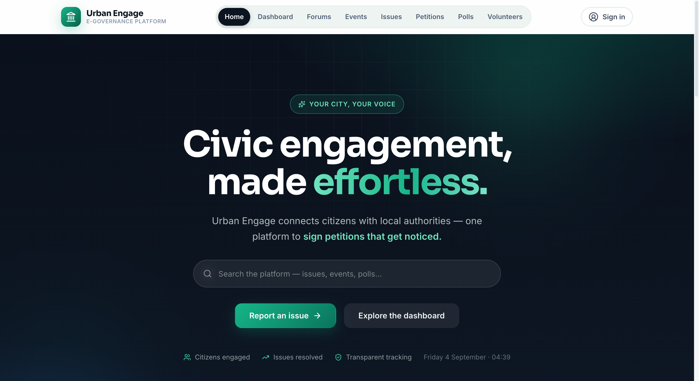

The hero section establishes the visual identity of Urban Engage while immediately introducing users to the platform's purpose.

### Platform Highlights

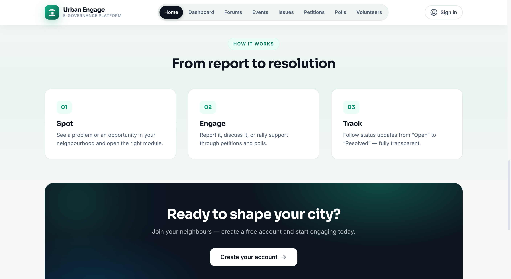

The highlights section communicates the main capabilities available throughout the platform.

### Quick Start

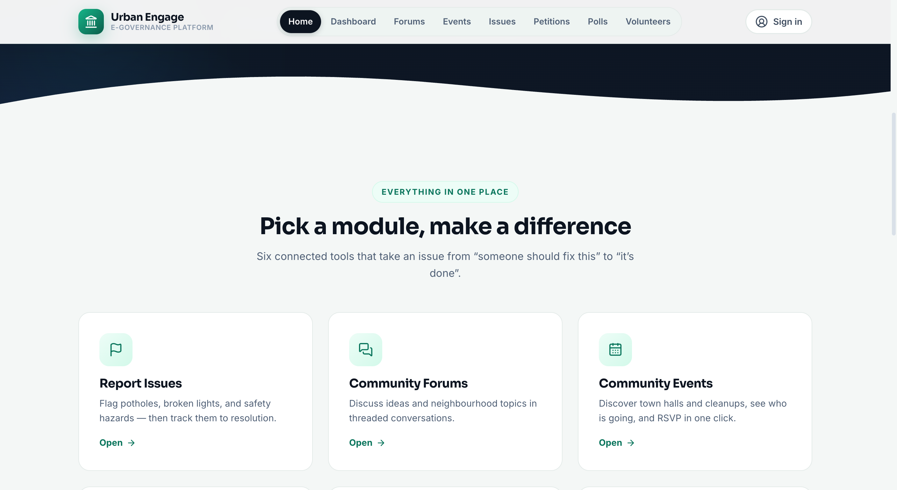

The quick-start experience helps users move directly from discovering the platform into useful civic actions.

---

## 📊 Dashboard

The Dashboard provides a centralized overview of activity across the platform.

Unlike a static dashboard, the current implementation retrieves live database information and presents the results through animated counters and activity sections.

### Dashboard capabilities

- Live platform statistics with real database counts
- Animated counters
- Recent activity
- Latest issues, events, and petitions
- Quick links to platform modules
- Loading, empty, and error states

### Dashboard Statistics

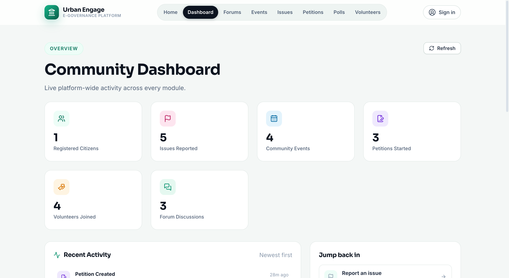

The statistics view presents an at-a-glance snapshot of activity across Urban Engage.

### Recent Activity

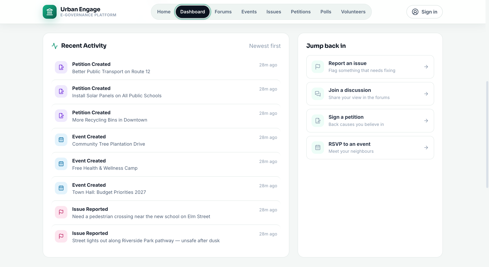

The activity feed combines recent records from multiple platform modules into one unified view.

---

## 💬 Forums

The Forums module provides a dedicated community discussion system.

Citizens can create discussion topics, discover existing conversations, search forum content, open a thread, read replies, and contribute to discussions.

### Forum capabilities

- Browse community discussions
- Search threads
- Create discussion threads
- View thread details in a thread drawer interface
- Read existing replies and add new ones
- Structured conversation flow
- Authentication-aware actions

### Forum Discussions

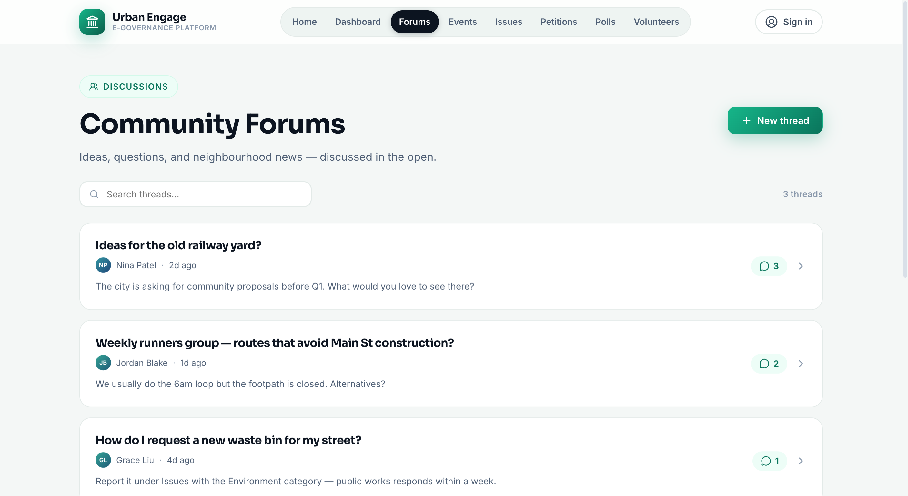

The forum view organizes discussions into an easy-to-browse community conversation interface.

### Create a Discussion

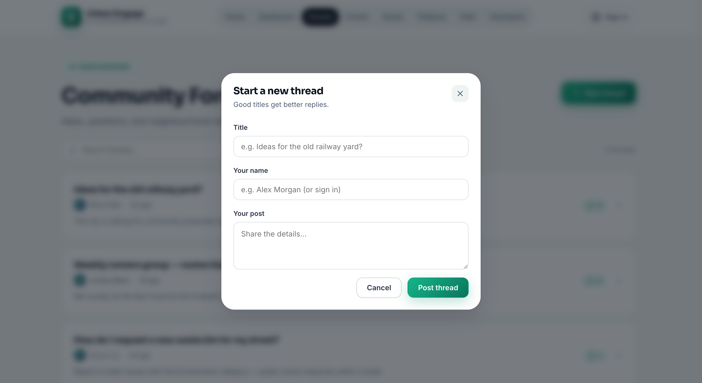

The forum creation workflow allows users to introduce new topics and initiate community conversations.

---

## 📅 Events

The Events module helps citizens discover, explore, and participate in community activities.

Events use structured information such as dates, locations, and categories so users can quickly understand what each event offers.

### Event capabilities

- Browse, search, and sort community events
- Display event dates, locations, and categories
- RSVP to events with one-per-browser duplicate protection
- Create events
- Delete events through the API
- Rich event cards with clear metadata

### Events View

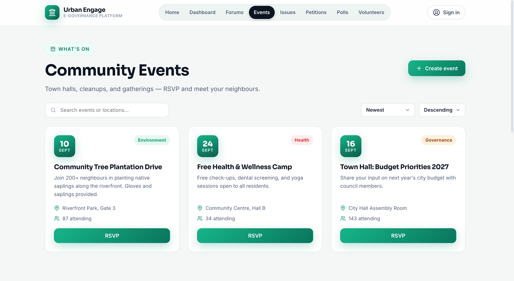

The events interface presents community activities using rich visual cards and supporting metadata.

### Add an Event

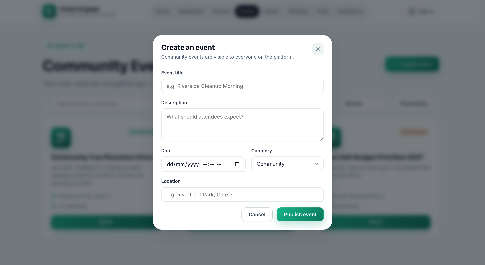

The event creation interface allows new community events to be added to the platform.

---

## 🚨 Issues

The Issues module provides one of the platform's core civic workflows: reporting and tracking community problems.

Citizens can report issues, categorize them, view existing reports, upvote issues, add comments, and track the progress of a reported problem.

Each issue follows a clear status pipeline:

```text
Open → In Progress → Resolved
```

### Issue capabilities

- Report civic issues and select categories
- Associate issues with authors
- Search issues and filter by category or status
- Upvote issues and add comments
- Update issue status and track progress
- Clear status indicators
- Loading, empty, and error states

### Issues Overview

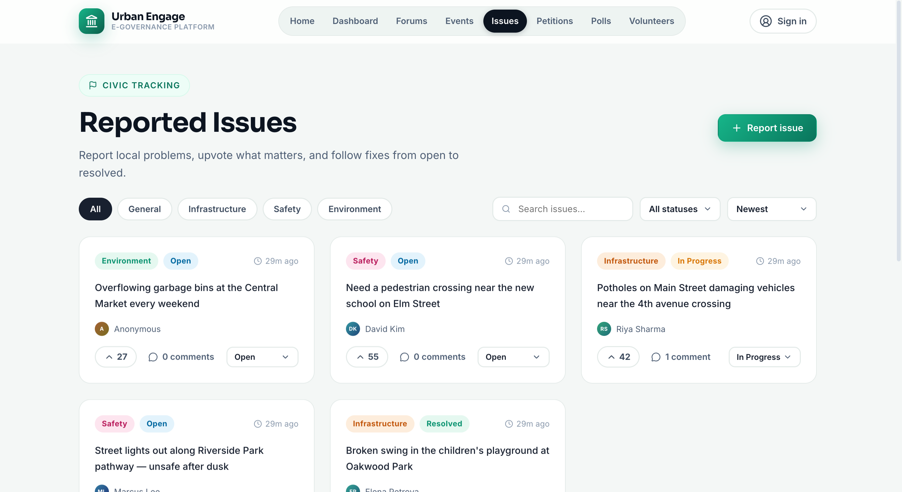

The Issues view provides a centralized interface for discovering and following reported civic problems.

### Report an Issue

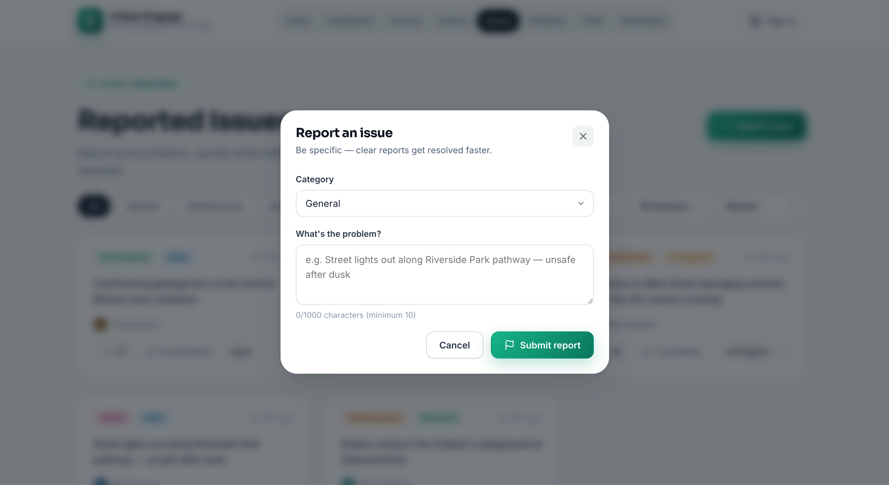

The issue submission workflow allows citizens to provide information about problems affecting their communities.

---

## 📝 Petitions

The Petitions module gives citizens a way to create and support community initiatives through digital signatures.

Petitions contain descriptions, signature goals, deadlines, and visible progress information.

### Petition capabilities

- Create petitions with descriptions, signature goals, and deadlines
- Sign petitions
- Track signature counts and progress toward goals
- Animated progress bars
- Participation information

### Petitions View

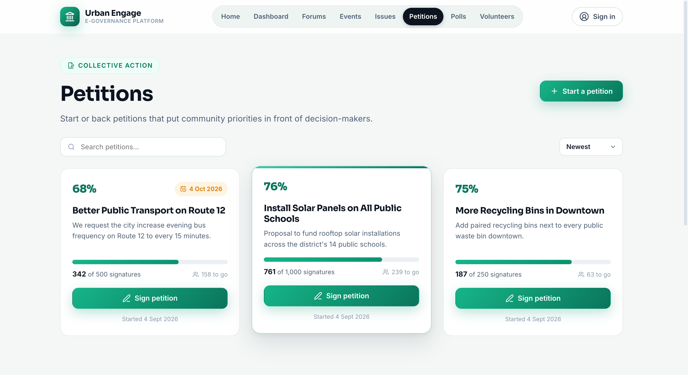

The petition interface presents community initiatives along with their current levels of support.

### Create a Petition

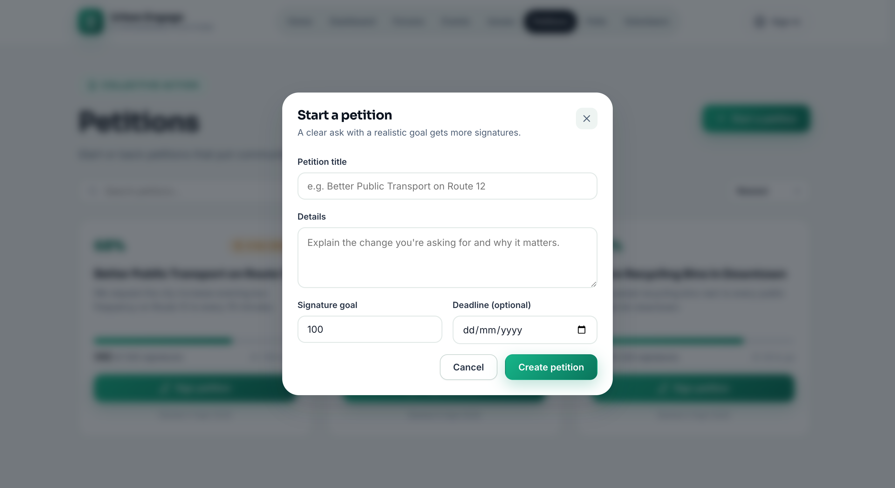

The petition creation interface enables users to define and publish new community initiatives.

---

## 🗳 Polls

The Polls module provides a simple and interactive mechanism for community voting.

Users can create polls with between two and five options, and participants can vote and immediately see the resulting distribution through animated visual bars.

### Poll capabilities

- Create polls with 2–5 options
- Vote on polls
- Display live result data
- Visualize results with animated bars
- Immediate interaction feedback

### Polls View

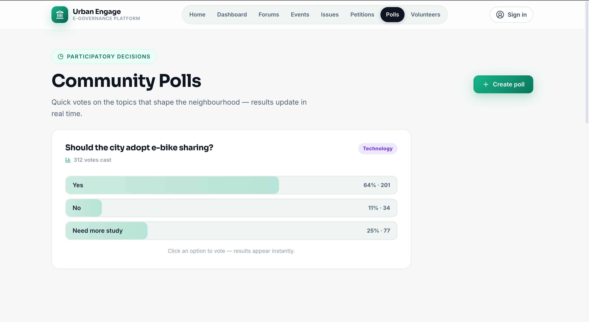

The poll results interface makes community preferences easy to interpret visually.

### Create a Poll

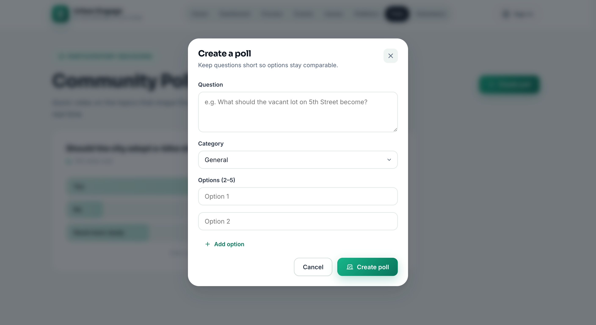

The poll creation workflow allows users to define a question and its possible responses.

---

## 🤝 Volunteers

The Volunteers module allows citizens to register their interest in contributing to community activities and initiatives.

The module supports category filtering and protects against duplicate registrations using email-based duplicate protection.

### Volunteer capabilities

- Volunteer registration with category selection
- Category filters
- Duplicate-email protection
- Grouped volunteer cards with structured information

### Volunteer Directory

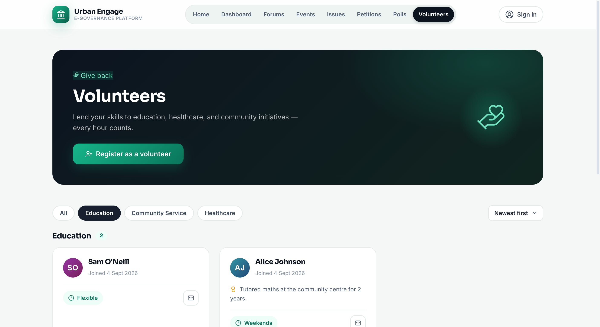

The volunteer directory organizes community contributors in a clear, searchable interface.

### Volunteer Registration

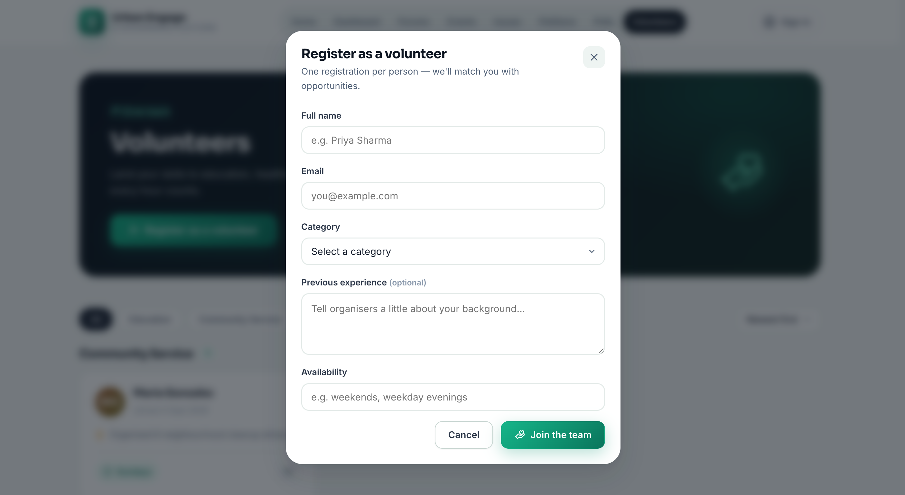

The registration flow allows citizens to express their interest in volunteering for community initiatives.

---

## 👤 Accounts & Authentication

Urban Engage includes a dedicated account system for authentication and profile management.

The authentication layer uses JWT-based sessions, while passwords are securely hashed with bcrypt.

### Account capabilities

- User registration and login
- Password strength meter
- JWT authentication and authenticated API requests
- Profile retrieval and editing
- Name and password updates
- Session persistence
- Toast notifications and validation feedback
- Protected API actions

### Sign In / Sign Up

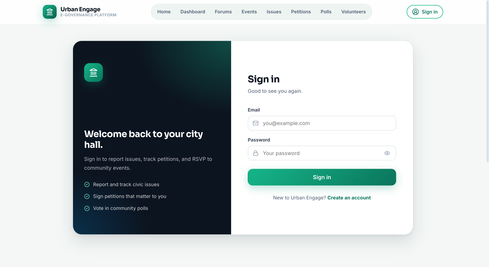

The account interface provides a unified authentication experience for registering and accessing an Urban Engage account.

### Logged-in User Experience

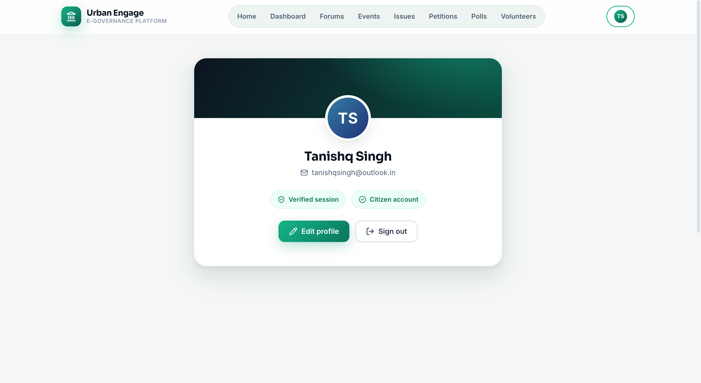

Authenticated users can access account-specific functionality and protected interactions throughout the platform.

---

## 🎨 Design & User Experience

Urban Engage was redesigned around a custom visual system with a strong emphasis on consistency, usability, responsiveness, and interaction feedback.

The frontend includes:

- Custom design tokens and CSS custom properties
- Consistent spacing and modern typography
- Responsive layouts
- Reusable components and animated interactions
- Clear status indicators
- Structured forms with consistent buttons and controls
- Accessible modal behavior
- Toast feedback
- Loading skeletons
- Empty and error states

The reusable UI layer includes components such as `Button`, `Modal`, `Badge`, `Avatar`, `Toast`, `Skeleton`, form controls, and navigation components.

---

## ♿ Accessibility

Accessibility and interaction quality are considered throughout the frontend.

The application includes:

- Keyboard-navigable modals
- Focus-visible rings
- Accessible interaction states
- `prefers-reduced-motion` support for users who prefer reduced animation
- Clear validation feedback
- Structured navigation
- Loading, empty, and error states

---

## 🧱 Technology Stack

**Frontend**

- React 18 (Create React App)
- React Router 6
- lucide-react
- Custom CSS design system with CSS custom properties
- React Context API
- Fetch-based API client

**Backend**

- Node.js and Express.js
- Mongoose and MongoDB
- JWT and bcrypt
- Helmet and rate limiting
- Request validation
- Centralized error handling

**Database**

- MongoDB (MongoDB Atlas in production, local MongoDB in development)
- Mongoose for schemas and database interaction

**Deployment**

- Netlify — frontend
- Render — backend
- MongoDB Atlas — production database

---

## 📁 Project Structure

```text
UrbanEngage/
├── backend/
│   ├── server.js          # App bootstrap: env config, security middleware, error handling
│   ├── seed.js            # Demo data seeder
│   ├── middleware/        # Authentication and validation middleware
│   ├── models/            # Mongoose schemas
│   ├── routes/            # REST endpoints per module
│   └── .env.example       # Required backend environment variables
│
├── frontend/
│   ├── public/
│   │   └── _redirects     # Netlify SPA routing
│   ├── src/
│   │   ├── api/           # API client and endpoint services
│   │   ├── context/       # AuthContext, ToastContext
│   │   ├── components/
│   │   │   ├── layout/    # Header, Footer
│   │   │   └── ui/        # Design-system components
│   │   ├── hooks/         # Reusable React hooks
│   │   ├── pages/         # Home, Dashboard, Forums, Events, Issues, Petitions,
│   │   │                  # Polls, Volunteers, Accounts
│   │   ├── styles/        # Design tokens and base styles
│   │   └── utils/         # Formatting and interaction helpers
│   └── .env.example       # REACT_APP_API_URL
│
├── docs/
│   └── screenshots/       # Project documentation screenshots
│
├── .gitignore
└── README.md
```

---

## 🔄 Application Architecture

Urban Engage follows a client/server architecture in which the React frontend communicates with a REST API provided by the Express backend.

```text
┌─────────────────────┐
│       Browser       │
│    React Frontend   │
└──────────┬──────────┘
           │
           │ REST API
           ▼
┌─────────────────────┐
│   Node.js / Express │
│      Backend API    │
└──────────┬──────────┘
           │
           │ Mongoose
           ▼
┌─────────────────────┐
│      MongoDB        │
│   Atlas / Local DB  │
└─────────────────────┘
```

### Production Architecture

```text
Browser — React UI (Netlify)
   │
   │  HTTPS REST API
   ▼
Express API — Node.js (Render)
   │
   │  Mongoose
   ▼
MongoDB Atlas
```

### Local Development Architecture

```text
React Dev Server (localhost:3000)
   │
   │  HTTP
   ▼
Express API (localhost:5050)
   │
   │  Mongoose
   ▼
Local MongoDB (localhost:27017)
```

---

## 🧰 Installation & Setup

### Prerequisites

Before running Urban Engage locally, make sure you have:

- **Node.js 14+** (18+ recommended)
- **MongoDB** — a local instance or a free [MongoDB Atlas](https://www.mongodb.com/atlas) cluster
- **Git**
- **npm** — included with Node.js

### 1. Clone the Repository

```bash
git clone https://github.com/singhtanishq/UrbanEngage.git
cd UrbanEngage
```

### 2. Backend Setup

Navigate into the backend directory and install dependencies:

```bash
cd backend
npm install
```

Create the local environment file:

```bash
cp .env.example .env
```

Open `.env` and configure the required variables:

```env
MONGODB_URI=mongodb://127.0.0.1:27017/UrbanEngageDB
JWT_SECRET=your_long_random_secret
JWT_EXPIRES_IN=7d
PORT=5050
NODE_ENV=development
```

Start the backend:

```bash
npm start
```

The local API will be available at `http://localhost:5050`.

### 3. Demo Data (Optional)

Urban Engage includes a demo data seeder. From the `backend` directory:

```bash
node seed.js --reset
```

This resets application data and creates realistic demo content.

The seeder also creates a demo account:

```text
Email:    demo@urbanengage.dev
Password: demopass123
```

### 4. Frontend Setup

Open another terminal, navigate to the frontend, and install dependencies:

```bash
cd frontend
npm install
```

Create the environment file:

```bash
cp .env.example .env
```

Set the backend API URL:

```env
REACT_APP_API_URL=http://localhost:5050
```

Start the React application:

```bash
npm start
```

The frontend will be available at `http://localhost:3000`.

### 🍎 macOS Note

On macOS, AirPlay Receiver listens on port `5000`. The bundled development configuration therefore uses port `5050` for the Urban Engage API.

You can either continue using port `5050`, or disable AirPlay Receiver from **System Settings → General → AirDrop & Handoff**.

---

## 🔐 Environment Variables

Urban Engage keeps environment-specific configuration and sensitive values outside of the source code.

| Variable            | Where    | Purpose                                              |
| ------------------- | -------- | ---------------------------------------------------- |
| `MONGODB_URI`       | backend  | MongoDB connection string (Atlas or local)           |
| `JWT_SECRET`        | backend  | Long random secret used to sign JWTs                 |
| `JWT_EXPIRES_IN`    | backend  | JWT token lifetime, default `7d`                     |
| `PORT`              | backend  | Backend API port; Render injects this automatically  |
| `NODE_ENV`          | backend  | Runtime environment                                  |
| `CORS_ORIGIN`       | backend  | Optional frontend-origin restriction                 |
| `REACT_APP_API_URL` | frontend | Backend base URL                                     |

Generate a strong JWT secret with:

```bash
openssl rand -hex 32
```

**Local frontend example:**

```env
REACT_APP_API_URL=http://localhost:5050
```

**Production frontend example:**

```env
REACT_APP_API_URL=https://urbanengage.onrender.com
```

---

## 🔌 API Reference

All endpoints return JSON and use standard HTTP status codes.

| Status | Meaning                               |
| ------ | ------------------------------------- |
| `400`  | Validation error or malformed request |
| `401`  | Authentication failure                |
| `404`  | Resource not found                    |
| `409`  | Duplicate or conflicting resource     |
| `500`  | Internal server error                 |

The API also exposes a health endpoint:

```text
GET /health
```

The health endpoint reports API uptime and database status.

### Accounts

| Method | Endpoint           | Authentication |
| ------ | ------------------ | -------------- |
| `POST` | `/accounts/signup` | Public         |
| `POST` | `/accounts/login`  | Public         |
| `POST` | `/accounts/update` | Required       |
| `GET`  | `/accounts/me`     | Required       |

Handles registration, authentication, profile retrieval, and profile updates.

### Dashboard

| Method | Endpoint           | Purpose                       |
| ------ | ------------------ | ----------------------------- |
| `GET`  | `/dashboard/stats` | Live counts + recent activity |
| `GET`  | `/dashboard`       | Legacy dashboard endpoint     |
| `POST` | `/dashboard`       | Legacy dashboard endpoint     |

### Forums

| Method | Endpoint                          | Purpose                    |
| ------ | --------------------------------- | -------------------------- |
| `GET`  | `/forums`                         | Retrieve forum discussions |
| `POST` | `/forums/add`                     | Create a forum thread      |
| `POST` | `/forums/threads/:threadId/reply` | Reply to a thread          |

### Events

| Method   | Endpoint           | Purpose          |
| -------- | ------------------ | ---------------- |
| `GET`    | `/events`          | Retrieve events  |
| `POST`   | `/events/add`      | Create an event  |
| `POST`   | `/events/rsvp/:id` | RSVP to an event |
| `DELETE` | `/events/:id`      | Delete an event  |

### Issues

| Method | Endpoint              | Purpose                  |
| ------ | --------------------- | ------------------------ |
| `GET`  | `/issues`             | Retrieve reported issues |
| `POST` | `/issues/add`         | Create an issue          |
| `POST` | `/issues/upvote/:id`  | Upvote an issue          |
| `POST` | `/issues/comment/:id` | Add an issue comment     |
| `POST` | `/issues/status/:id`  | Update issue status      |

### Petitions

| Method | Endpoint              | Purpose            |
| ------ | --------------------- | ------------------ |
| `GET`  | `/petitions`          | Retrieve petitions |
| `POST` | `/petitions/add`      | Create a petition  |
| `POST` | `/petitions/sign/:id` | Sign a petition    |

### Polls

| Method | Endpoint          | Purpose        |
| ------ | ----------------- | -------------- |
| `GET`  | `/polls`          | Retrieve polls |
| `POST` | `/polls/add`      | Create a poll  |
| `POST` | `/polls/vote/:id` | Vote in a poll |

### Volunteers

| Method | Endpoint          | Purpose              |
| ------ | ----------------- | -------------------- |
| `GET`  | `/volunteers`     | Retrieve volunteers  |
| `POST` | `/volunteers/add` | Register a volunteer |

> **Note:** Legacy `Home / Features` content endpoints remain available and unchanged.

---

## 🔑 Authentication

Authenticated requests send the JWT using:

```http
Authorization: Bearer <token>
```

The frontend API client reads the backend base URL from `REACT_APP_API_URL`, which enables the same frontend codebase to communicate with both local and production backend environments.

---

## 🚀 Deployment

### Backend — Render

The backend is deployed as a Render Web Service.

Create a Web Service from the repository and configure:

| Setting         | Value         |
| --------------- | ------------- |
| Root Directory  | `backend`     |
| Build Command   | `npm install` |
| Start Command   | `npm start`   |

Production environment variables:

```env
MONGODB_URI=<MongoDB Atlas connection string>
JWT_SECRET=<long random production secret>
NODE_ENV=production
CORS_ORIGIN=https://urbanengage.netlify.app
```

`PORT` is provided automatically by Render.

> **Important:** Never commit production MongoDB credentials or JWT secrets into the repository. If credentials have ever been exposed in Git history or a public repository, rotate them immediately.

### Frontend — Netlify

The React frontend is deployed through Netlify.

| Setting           | Value           |
| ----------------- | --------------- |
| Build Command     | `npm run build` |
| Publish Directory | `frontend/build`|

Environment variable:

```env
REACT_APP_API_URL=https://urbanengage.onrender.com
```

The frontend requires this value in production so that API requests are sent to the deployed backend rather than the Netlify origin.

The repository already includes `frontend/public/_redirects`, which ensures client-side routes such as `/issues`, `/events`, `/forums`, `/petitions`, `/polls`, and `/volunteers` work correctly on Netlify.

---

## 🗄 Database

Urban Engage uses MongoDB through Mongoose.

**Local MongoDB** — a local development database can be configured using:

```text
mongodb://127.0.0.1:27017/UrbanEngageDB
```

**MongoDB Atlas** — for production, configure:

```env
MONGODB_URI=<MongoDB Atlas connection string>
```

Database credentials are intentionally kept outside the source code.

---

## 🔒 Security

Security is treated as an important part of the backend architecture. Urban Engage includes:

- Environment-based secret management
- Password hashing with bcrypt
- JWT authentication and authentication middleware
- Request validation
- Centralized error handling
- Helmet security headers
- Rate limiting
- Request body size limits
- Duplicate protection
- CORS configuration
- Authentication-aware responses
- Invalid JWT tokens returning `401`
- Login behavior that does not reveal whether an account exists

### Sensitive Credentials

The original implementation contained a hardcoded MongoDB Atlas URI with credentials and a hardcoded JWT secret. Those credentials have been removed from the source code, and the application now reads secrets through environment variables.

> **Important:** If this repository was ever public while database credentials were present, rotate the MongoDB password immediately. In MongoDB Atlas: **Atlas → Database Access → Edit User → Change Password**. Generate a new production JWT secret as well:

```bash
openssl rand -hex 32
```

---

## 🧪 Development Workflow

A typical development workflow:

1. Clone the repository
2. Install backend dependencies
3. Configure backend environment variables
4. Start MongoDB
5. Start the Express API
6. Install frontend dependencies
7. Configure frontend environment variables
8. Start the React development server
9. Develop and test
10. Commit and push changes

---

## 📸 Documentation Screenshots

The repository includes dedicated screenshots under `docs/screenshots/`, covering all major application workflows:

```text
home-hero.png
home-highlights.png
home-quick-start.png

dashboard-stats.png
dashboard-activities.png

forums-view.png
forums-add.png

events-view.png
events-add.png

issues-view.png
issues-add.png

petitions-view.png
petitions-add.png

polls-view.png
polls-add.png

volunteers-view.png
volunteers-add.png

sign-in.png
logged-user.png
```

These screenshots are maintained alongside the codebase so that the README documents both functionality and the actual application interface.

---

## 📌 Development Notes

### Frontend API Configuration

The frontend uses an environment-driven API base URL:

- **Local:** `REACT_APP_API_URL=http://localhost:5050`
- **Production:** `REACT_APP_API_URL=https://urbanengage.onrender.com`

This allows environment-specific configuration without modifying application source code.

### Backend Port

The local backend uses port `5050`. Render automatically provides the production port through the `PORT` environment variable, so the production deployment does not hardcode a Render-specific port.

---

## 👐 Contributing

Contributions, bug fixes, improvements, documentation updates, and feature ideas are welcome. Please follow the workflow below when contributing.

### 1. Fork the Project

Create your own fork of the Urban Engage repository.

### 2. Clone Your Fork

```bash
git clone https://github.com/YOUR_USERNAME/UrbanEngage.git
cd UrbanEngage
```

### 3. Create a Feature Branch

```bash
git checkout -b feature/AmazingFeature
```

Use a descriptive branch name for your change, for example:

```text
feature/issue-filters
feature/event-search
fix/authentication-error
docs/update-readme
```

### 4. Install Dependencies

Backend:

```bash
cd backend
npm install
```

Frontend:

```bash
cd ../frontend
npm install
```

### 5. Configure Environment Variables

Create the local `.env` files from their corresponding `.env.example` files.

Never commit `.env`, `.env.local`, `.env.production`, or any file containing real credentials.

### 6. Run the Application

Start the backend:

```bash
cd backend
npm start
```

Start the frontend in a separate terminal:

```bash
cd frontend
npm start
```

### 7. Test Your Changes

Before opening a Pull Request, verify that:

- The affected functionality works as expected
- Existing modules still work
- API interactions behave correctly
- Authentication remains functional where applicable
- UI states are handled correctly
- No secrets or credentials are committed
- Relevant documentation or screenshots are updated when necessary

### 8. Commit Your Changes

```bash
git add .
git commit -m "Add some AmazingFeature"
```

Keep commit messages clear and descriptive.

### 9. Push Your Branch

```bash
git push origin feature/AmazingFeature
```

### 10. Open a Pull Request

Open a Pull Request from your feature branch to the project's `main` branch.

A useful Pull Request description should explain:

- What changed and why
- Which modules are affected
- Any setup changes required
- Any screenshots or documentation updates
- Any known limitations

---

## 🧹 Git & Repository Hygiene

The repository intentionally excludes generated files, local configuration, database backups, and operating-system files. The `.gitignore` includes entries such as:

```text
node_modules/
.env
.env.local
.env.production
frontend/build/
mongo-backup/
*.log
.DS_Store
```

Database dumps and local environment files should never be committed to the public repository.

---

## 🧩 Module Summary

Urban Engage currently provides the following major modules:

- **🏠 Home** — the landing experience that introduces the platform, communicates its purpose, and provides quick access to civic actions.
- **📊 Dashboard** — a data-driven overview with live platform statistics, recent activity, animated counters, and quick links.
- **💬 Forums** — a structured community discussion system supporting thread creation, searching, thread viewing, and replies.
- **📅 Events** — a community event system supporting discovery, searching, sorting, RSVP, and event creation.
- **🚨 Issues** — a civic issue reporting system supporting categories, filtering, comments, upvotes, and status progression from Open to Resolved.
- **📝 Petitions** — a digital petition system supporting descriptions, signature goals, deadlines, signing, and visual progress tracking.
- **🗳 Polls** — a community voting system supporting poll creation, participation, and animated results.
- **🤝 Volunteers** — a volunteer registration system supporting categories, filtering, grouped records, and duplicate-email protection.
- **👤 Accounts** — a complete authentication and profile-management system using JWT sessions, bcrypt password hashing, validation, profile editing, and user feedback.

---

## 📈 Future Expansion

The current platform provides a foundation that can be extended with additional civic functionality. Potential future directions include:

- Administrative dashboards and role-based access control
- Government and authority accounts
- Issue assignment workflows
- Notifications and email notifications
- Real-time updates
- Advanced analytics
- Geographic issue mapping
- Document attachments
- Civic announcements
- Moderation tools and fine-grained permissions
- Audit logs
- Enhanced search
- Mobile applications

These are potential future directions and are not presented as currently implemented features.

---

## 🧭 Project Philosophy

Urban Engage is built around the idea that civic participation should be:

```text
Accessible · Transparent · Interactive · Community-driven · Data-informed
```

Instead of treating civic engagement as a collection of isolated actions, the platform connects reporting, discussion, participation, voting, petitions, events, and volunteering into one experience.

---

## 📜 License

Distributed under the MIT License. See the `LICENSE` file for more information.

---

## 💼 About This Project

**Urban Engage** is a full-stack e-governance platform built around the idea of making civic participation more accessible, interactive, and transparent. It brings together civic issue reporting, community discussions, events, petitions, polls, volunteering, accounts & authentication, and platform analytics into one unified digital experience.

---

<div align="center">

**🌐 Explore Urban Engage**

[🚀 View the Live Project](https://urbanengage.netlify.app/)

**Frontend:** Netlify · **Backend:** Render · **Database:** MongoDB Atlas

Built with React, Node.js, Express & MongoDB

⭐ If you find this project useful, please consider starring the repository!

</div>
